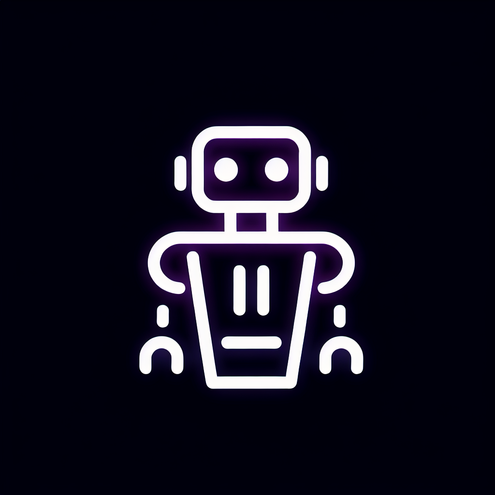

```
  _____          _      __  __       _       
 / ____|        | |    |  \/  |     | |      
| |     ___   __| | ___| \  / | __ _| |_ ___ 
| |    / _ \ / _` |/ _ \ |\/| |/ _` | __/ _ \
| |___| (_) | (_| |  __/ |  | | (_| | ||  __/
 \_____\___/ \__,_|\___|_|  |_|\__,_|\__\___|
                                              
```

# CodeMate - Minecraft Mod Development Platform


A cutting-edge Minecraft mod development platform that leverages advanced AI capabilities to transform the modding experience for NeoForge 1.21.5, with enhanced AI interaction tools and template-based project creation.

<div align="center">
  <p>
    
  </p>
  <h3>Revolutionizing Minecraft Mod Development with AI</h3>
  <a href="https://codemate.github.io/minecraft-modding-platform">View Demo</a>
</div>

## Core Features

### Intelligent Development Environment

- **Advanced Code Editor**: Monaco-based code editor with syntax highlighting, code completion, and error detection
- **Searchable File Manager**: Easily navigate and search through project files
- **Integrated Console Output**: Real-time logging and debugging information
- **Tabbed Interface**: Switch between code editor, architecture visualization, testing, and migration tools

### AI-Powered Assistance

- **Claude AI Integration**: Contextual coding assistance with specialized knowledge about Minecraft modding
- **Code Suggestions**: One-click application of AI-suggested code improvements
- **Voice Mode**: Natural language interaction with Claude for hands-free development
- **Dual-Model Architecture**: Uses Claude-3-7-Sonnet for voice interactions and Claude Code for programming tasks

### Project Management

- **Template-Based Creation**: Start new projects with predefined NeoForge 1.21.5 templates
  - Empty Project
  - Basic Item Mod
  - Basic Block Mod
  - Complete Example Mod
- **Authentication System**: Secure user accounts and project management
- **PostgreSQL Database**: Reliable storage for projects, files, and user data

### Minecraft-Specific Features

- **Biome Theme UI**: Dynamic UI themes inspired by Minecraft biomes with custom styling
- **Mod Visualization Tools**: Architecture diagrams and component relationships
- **Testing Environment**: Automated mod testing and validation
- **Migration Wizard**: Tools for updating mods between Minecraft versions

### Visual Features

- **Pixel Font Integration**: Minecraft-style typography for themed UI elements
- **Responsive Design**: Works on desktop and mobile devices
- **Dark Mode**: Eye-friendly interface for long coding sessions

## API Reference

### Authentication API

- `POST /api/register`: Create a new user account
  ```json
  { "username": "string", "password": "string" }
  ```
- `POST /api/login`: Authenticate user and create session
  ```json
  { "username": "string", "password": "string" }
  ```
- `POST /api/logout`: End current user session
- `GET /api/user`: Get current authenticated user data

### Projects API

- `GET /api/projects`: List all projects for authenticated user
- `GET /api/projects/:id`: Get specific project details
- `POST /api/projects`: Create a new project
  ```json
  {
    "name": "string",
    "description": "string",
    "modVersion": "string",
    "minecraftVersion": "string",
    "neoForgeVersion": "string",
    "templateId": "string"
  }
  ```
- `PUT /api/projects/:id`: Update project details
- `DELETE /api/projects/:id`: Delete a project

### Files API

- `GET /api/projects/:projectId/files`: List all files in a project
- `GET /api/files/:id`: Get file content
- `POST /api/files`: Create a new file
  ```json
  {
    "projectId": "number",
    "path": "string",
    "name": "string",
    "content": "string"
  }
  ```
- `PUT /api/files/:id`: Update file content
  ```json
  {
    "content": "string"
  }
  ```
- `DELETE /api/files/:id`: Delete a file

### AI Assistant API

- `POST /api/chat`: Send message to Claude AI
  ```json
  {
    "message": "string",
    "projectId": "number",
    "fileId": "number (optional)"
  }
  ```
- `POST /api/generate-code`: Request code generation for specific task
  ```json
  {
    "prompt": "string",
    "language": "string",
    "projectId": "number",
    "fileId": "number (optional)"
  }
  ```
- `POST /api/fix-error`: Request AI to analyze and fix code errors
  ```json
  {
    "code": "string",
    "error": "string",
    "language": "string",
    "projectId": "number"
  }
  ```

## Technical Stack

- **Frontend**: React, TypeScript, Tailwind CSS
- **UI Components**: Shadcn UI, Radix UI
- **State Management**: React Query
- **Backend**: Express.js, Node.js
- **Database**: PostgreSQL with Drizzle ORM
- **Authentication**: Passport.js, express-session
- **AI Integration**: Anthropic Claude API
- **Editor**: Monaco Editor with custom extensions
- **Build Tools**: Vite, esbuild

## Getting Started

<div align="center">
  
</div>

1. Clone the repository
2. Install dependencies with `npm install`
3. Set up environment variables (see `.env.example`)
4. Start the development server with `npm run dev`
5. Navigate to the provided URL to access the application

## Deployment

### GitHub Pages Deployment

CodeMate can be deployed to GitHub Pages for easy access. We've included a fully automated GitHub Actions workflow.

1. Push your code to GitHub
2. Enable GitHub Pages in your repository settings
3. The GitHub Action will handle the build and deployment automatically

For more details, see [GITHUB_PAGES.md](GITHUB_PAGES.md)

## Environment Variables

```
DATABASE_URL=your-database-connection-string
SESSION_SECRET=your-secure-session-secret
ANTHROPIC_API_KEY=your-api-key
```

## Licensing and Credits

- Developed for NeoForge modding community
- Minecraft is a registered trademark of Mojang Studios
- Claude AI integration powered by Anthropic

<div align="center">
  
  <br>
  <a href="https://github.com/codemate/minecraft-modding-platform/issues">Report Bug</a>
  ·
  <a href="https://github.com/codemate/minecraft-modding-platform/issues">Request Feature</a>
  <br><br>
  © 2025 CodeMate Development Team
</div>